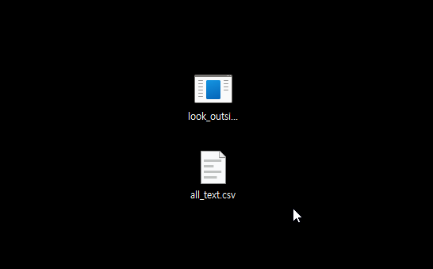

# RPGMaker-Localization-LookOutside

(WIP) Look Outside 한글 패치

- 게임 데이터의 저작권은 모두 제작사에 있습니다.
  - 이 패치는 제작사의 요청에 의해 언제든 삭제될 수 있습니다.
- 수정 및 재배포 금지입니다.

## 게임

- [스팀 상점 페이지](https://store.steampowered.com/app/3373660/Look_Outside/)
- patch: 2.00
- build: 2.17
- ko: 2.0.11

## 라이센스

- 폰트: [둥근모꼴+Fixedsys](https://cactus.tistory.com/193)

## 사용법

1. [최신 Release](https://github.com/killterm/RPGMaker-Localization-LookOutside/releases/latest)를 게임 설치 경로에 다운로드
2. 패치 프로그램(exe) 실행: 내장된 번역 데이터로 패치를 진행합니다.

---

본인이 적용하고자 하는 번역 데이터가 있을 경우 알맞는 형식의 CSV 파일을 끌어다 놓으면 적용됩니다. 헤더로 `SourceFile`, `Original`, `ko`가 있어야 하고, 각각 파일명을 포함 상대 경로, 원문, 번역문이 있어야 합니다.

